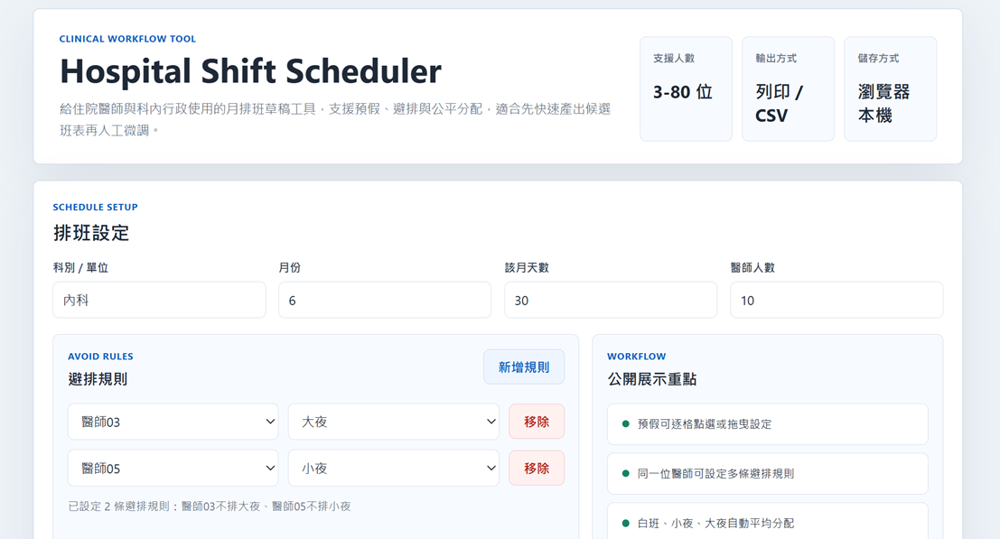
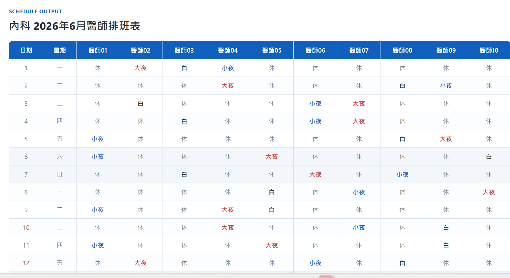

# Hospital Shift Scheduler

Static browser-based tool for drafting monthly hospital duty rosters with pre-leave planning, shift-avoid rules, printable output, and CSV export. An example from Taiwanese hospital.

醫療排班工作流程工具，適合醫學生排夜間學習排程，也可調整成適合住院醫師、總醫師或科內行政快速產生月班表草稿。先完成初步平均分配，再進行人工微調。

過去醫院醫學生排班夜間學習時，總是讓負責排班的同學傷透腦筋，採用這個開源網頁後，先初步幫大家安排，再依需要調整。也有將此計畫給醫院老師看，老師表示考慮納入急診醫學部班表安排流程。

## Screenshots

### Setup View

實際設定畫面：輸入科別、月份、醫師人數，並加入避排規則。



### Generated Schedule

實際輸出畫面：產生月班表後，可直接檢視、列印或後續匯出 CSV。



## Why This Exists

臨床排班常常需要在有限時間內同時處理：

- 多位醫師的白班、小夜、大夜分配
- 個別醫師的預假需求
- 指定醫師不可排某些班次的限制
- 列印與匯出，方便後續人工確認與調整

這個專案的目標不是取代最後的人工作業，而是先快速產出可用的候選班表，減少手排與反覆修表的時間成本。

## Quick Summary

- Browser-based monthly doctor schedule draft generator
- Supports 3-80 doctors
- Includes pre-leave matrix and doctor-specific shift-avoid rules
- Exports printable tables and UTF-8 CSV
- Designed for real clinical scheduling workflows before manual fine-tuning

## Current Features

- 支援 **3-80 位醫師** 的月班表草稿產生
- 依月份自動帶入當月天數
- **預假設定**：逐格點選或拖曳標記不可排班日期
- **避排規則**：可指定某位醫師不排白班、小夜或大夜
- **公平分配**：盡量讓總工作班數差距控制在 1 班內
- **輸出**：直接列印或匯出 CSV
- **純前端靜態頁面**：不需後端、不需安裝套件

## Project Positioning

這是一個從臨床排班情境衍生的開源工具，用於：

- 科內排班草稿產生
- 多名醫師輪值的初版安排
- 月排班前的候選班表建立與人工微調前處理

專案描述以可驗證的功能與實際使用情境為主。

## Demo

- 主要 demo 檔案：[`docs/index.html`](docs/index.html)
- GitHub Pages demo：`https://mrchiutw.github.io/hospital-shift-scheduler/`
- repo homepage 已指向目前公開 demo

## Project Structure

```text
docs/                公開展示用靜態 demo
docs_legacy/         舊版展示頁保留
Reference/           早期原型與歷史輸出
```

## Local Usage

1. 直接在瀏覽器開啟 `docs/index.html`
2. 輸入科別、月份與醫師人數
3. 視需要設定預假與避排規則
4. 產生班表後列印或匯出 CSV
5. 若要展示範例，可使用 `?demo=1&dept=內科&month=6&doctors=10`

## Maintenance Direction

目前規劃中的維護工作包含：

- README / 文件持續補強
- demo 與編碼顯示品質改善
- 排班限制規則細化
- 輸出格式與手動調整流程優化

目前開發方向可從 issue 區的 roadmap 追蹤。
